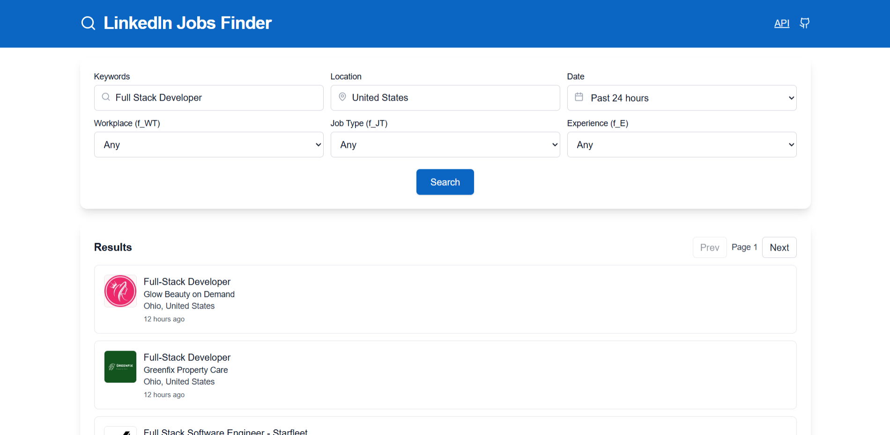

# LinkedIn Jobs Finder



A lightweight Next.js app to search and preview LinkedIn job listings with a clean UI, server-side routes, and a tiny API layer. It features keyword/location filters, date range mapping, workplace and job type filters, pagination, and a job details page. Company logos are reliably rendered via an image proxy.

## Quick Links
- **Home**: search with filters
- **API Docs**: visit `/docs`
- **Repository**: `https://github.com/sidmaz666/linkedInjobs`

## Features
- Comprehensive search with filters: keywords, location, date, workplace (`f_WT`), job type (`f_JT`), experience (`f_E`)
- Pagination with clear navigation
- Job details with title, company, location, logo, posted text, apply link, and description
- Reliable logo rendering via `/api/jobs/media` (returns base64 data URLs)
- Accessible, responsive UI styled with Tailwind

## Tech Stack
- Next.js App Router
- TypeScript + React
- Tailwind CSS

## API
Base URL: `/api`

### GET `/api/jobs`
Query params (with examples):
- `keywords` (string): terms to search for in job titles/descriptions.
  - Example: `keywords=full%20stack%20developer`
- `location` (string): human-friendly location or `Remote`.
  - Examples: `location=United%20States`, `location=Remote`, `location=London`
- `date` (enum): posted date window.
  - Allowed: `past-24` (last 24h), `past-week` (7 days), `past-mon` (30 days), `anytime`
  - Example: `date=past-week`
- `f_WT` (enum): workplace type.
  - Values: `1` = on-site, `2` = hybrid, `3` = remote
  - Example: `f_WT=3` (remote-only roles)
- `f_JT` (enum): job type.
  - Values: `F` = full-time, `P` = part-time, `I` = internship
  - Example: `f_JT=F`
- `f_E` (enum range): experience level.
  - Values (LinkedIn scale): `2`=Entry, `3`=Associate, `4`=Mid-Senior, `5`=Director, `6`=Executive
  - Examples: `f_E=2` (entry-level), `f_E=3` (associate)
- `page` (number, 1-based): pagination page index.
  - Example: `page=2`

Example:

```bash
GET /api/jobs?keywords=frontend&location=Remote&date=past-week&page=1
```

```ts
fetch('/api/jobs?keywords=frontend&location=Remote&date=past-week&page=1')
  .then(r => r.json())
  .then(data => console.log(data))
```

### GET `/api/jobs/[jobId]`
Returns the job details for a specific LinkedIn job id.

```bash
GET /api/jobs/1234567890
```

```ts
fetch('/api/jobs/1234567890')
  .then(r => r.json())
  .then(job => console.log(job))
```

### GET `/api/jobs/media?url=<imageUrl>`
Image proxy that returns a base64 data URL for stable logo rendering.

```bash
GET /api/jobs/media?url=https%3A%2F%2Fexample.com%2Flogo.png
```

## Local Development

Install dependencies and run the dev server:

```bash
npm install
npm run dev
# or yarn / pnpm / bun equivalents
```

Open `http://localhost:3000` in your browser.

## Project Structure
- `app/` — App Router pages, routes, and styles
  - `app/page.tsx` — search UI
  - `app/[jobId]/page.tsx` — job details page
  - `app/api/jobs` — API routes (search, details, media)
  - `app/docs/page.tsx` — API documentation
- `components/` — UI components
  - `JobSearchApp`, `ResultsList`, `Pagination`, `LazyLogo`, etc.

## Notes
- All endpoints return JSON unless otherwise noted
- Requires .env var `NEXT_PUBLIC_SITE_URL`
